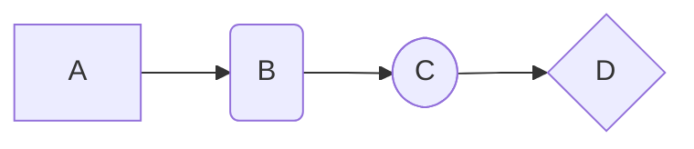
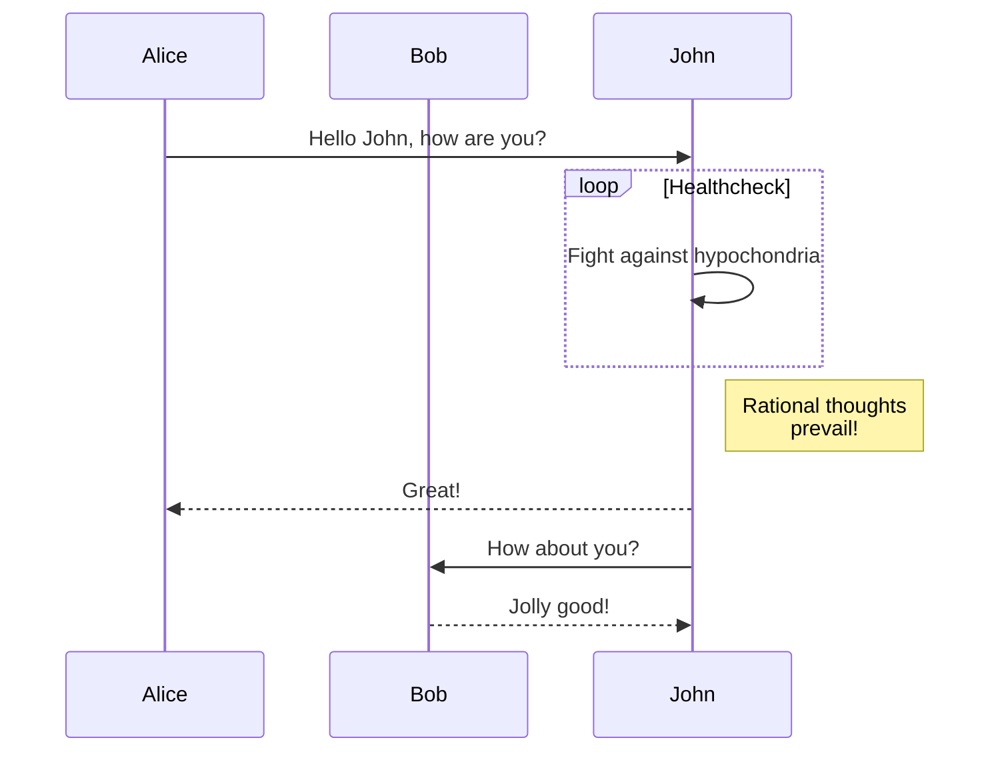
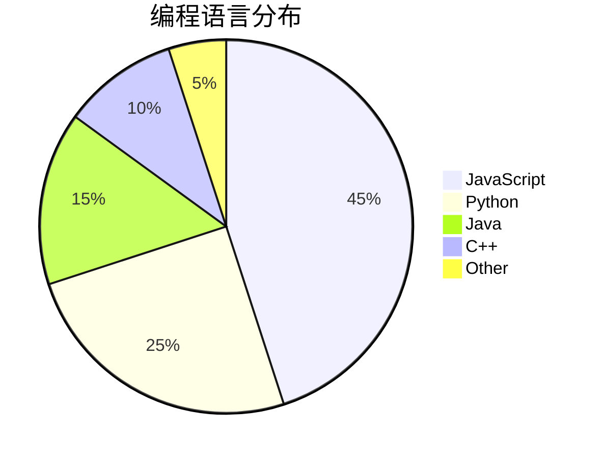

## 1. 标题 (Headers)

# 一级标题 (H1)

## 二级标题 (H2)

### 三级标题 (H3)

#### 四级标题 (H4)

##### 五级标题 (H5)

###### 六级标题 (H6)

---

## 2. 文本样式 (Text Styles)

_这是斜体文本_
_这也是斜体文本_

**这是粗体文本**
**这也是粗体文本**

**_这是粗斜体文本_**
**_这也是粗斜体文本_**

~~这是带删除线的文本~~

这是一个 `行内代码` 的例子。

> 这是一个块引用。
>
> > 这是一个嵌套的块引用。

---

## 3. 列表 (Lists)

### 无序列表

- 列表项 A
- 列表项 B
  - 嵌套列表项 B1
  - 嵌套列表项 B2
- 列表项 C

### 有序列表

1.  第一项
2.  第二项
    1.  嵌套第一项
    2.  嵌套第二项
3.  第三项

### 任务列表 (Task Lists)

- [x] 已完成的任务
- [ ] 未完成的任务
- [ ] 待办事项

---

## 4. 代码块 (Code Blocks)

这是一个行内代码块：`console.log('Hello, World!');`

这是一个带有语法高亮的 Python 代码块：

```python
import antigravity

def greet(name):
    """这是一个向世界问好的函数"""
    print(f"Hello, {name}!")

if __name__ == "__main__":
    greet("Markdown")
```

这是一个没有指定语言的普通代码块：

```text
npm install
npm run dev
```

---

## 5. 链接与图片 (Links & Images)

### 链接

这是一个指向 [OpenAI](https://www.openai.com) 的链接。

### 图片


---

## 6. 表格 (Tables)

| 对齐方式 | 左对齐 | 居中对齐 | 右对齐 |
| :------- | :----- | :------: | -----: |
| **内容** | Cell 1 |  Cell 2  | Cell 3 |
| **示例** | a      |    b     |      c |
| **数据** | 123    |   456    |    789 |

---

## 7. 脚注 (Footnotes)

这是一个需要脚注的句子[^1]。这是另一个需要脚注的地方[^footnote2]。

## 8. 数学公式 (KaTeX)

HAKU 支持 LaTeX 语法的数学公式以及化学公式渲染。

### 行内公式

质能方程是 $ E=mc^2 $。当 $ a \ne 0 $ 时，二次方程 $ ax^2 + bx + c = 0 $ 的解为 $ x = {-b \pm \sqrt{b^2-4ac} \over 2a} $。

```latex
质能方程是 $ E=mc^2 $。当 $ a \ne 0 $ 时，二次方程 $ ax^2 + bx + c = 0 $ 的解为 $ x = {-b \pm \sqrt{b^2-4ac} \over 2a} $。
```

### 块级公式

麦克斯韦方程组 (积分形式):

$$

\oint_S \mathbf{D} \cdot d\mathbf{a} = Q_{in} \\
\oint_S \mathbf{B} \cdot d\mathbf{a} = 0 \\
\oint_C \mathbf{E} \cdot d\mathbf{l} = - \frac{d\Phi_B}{dt} \\
\oint_C \mathbf{H} \cdot d\mathbf{l} = I_{in} + \frac{d\Phi_D}{dt}


$$

```latex
$$

\oint_S \mathbf{D} \cdot d\mathbf{a} = Q_{in} \\
\oint_S \mathbf{B} \cdot d\mathbf{a} = 0 \\
\oint_C \mathbf{E} \cdot d\mathbf{l} = - \frac{d\Phi_B}{dt} \\
\oint_C \mathbf{H} \cdot d\mathbf{l} = I_{in} + \frac{d\Phi_D}{dt}

$$
```

---

## 9. Mermaid 图表渲染

测试是否支持通过代码生成图表。

### 流程图 (Flowchart)

需要注意的是目前的流程图有 bug，过于复杂的图形会导致展示崩溃。这可能会在以后的版本修复。



### 序列图 (Sequence Diagram)



### 饼图 (Pie Chart)



---

## 10. 提示/警告块 (Admonitions/Alerts)

这种语法在 GitHub、Docsify 和许多文档生成器中很流行。

> [!NOTE]
> 这是一个提示（Note）。用于引起注意的普通信息。

> [!TIP]
> 这是一个技巧（Tip）。用于提供有用的建议或快捷方式。

> [!IMPORTANT]
> 这是重要信息（Important）。需要用户特别关注的内容。

> [!WARNING]
> 这是一个警告（Warning）。用于提示潜在的风险或需要谨慎操作的地方。

> [!CAUTION]
> 这是一个危险警告（Caution）。表示执行此操作可能会导致严重后果。

:::note[自定义标题]
这是一个自定义标题的提示块。
:::

---

## 11. 嵌入 HTML (Embedded HTML)

测试是否允许在 Markdown 中直接嵌入 HTML 代码。

### 可折叠内容

使用 `:::fold[title] ... :::` 来创建一个可折叠的内容区域。

:::fold[点击展开查看详细信息]
这里是隐藏的详细内容。可以包含段落、列表、甚至是图片。
:::

```text
:::fold[点击展开查看详细信息]
这里是隐藏的详细内容。可以包含段落、列表、甚至是图片。
:::
```

### 文本样式

使用 HTML 标签来改变文本颜色：这段文字应该是 <span style="color: #007bff;">蓝色</span> 的，而这段是 <span style="color: #dc3545;">红色</span> 的。

[^1]: 这是第一个脚注的解释文本。

[^footnote2]: 这是第二个脚注的详细内容，可以很长。
